# Concordium Pay&Verify Demo

It's a demo online store requiring age verification to pay for its goods.

## API

It's a public JSON API. In order for it to respond properly the client must set `Accept: application/json` header.

### Get an invoice

Returns a particular invoice.

#### Query

GET `api/v1/invoices/{invoiceId}`

#### Path parameters

- `invoiceId` – string identifier of a particular invoice

#### Successful response

A JSON object with the following fields:

- `version` – int, invoice version, currently `1`
- `id` – string, invoice identifier
- `status` – string, one of the invoice statuses:
    - `"pending"` – invoice is created and waiting to be paid
    - `"paid"` – invoice is paid and verified successfully
    - `"failed"` – invoice is failed and can no longer be paid
- `paymentType` – string, one of the payment types:
    - `"cis2"` – this invoice must be paid with a CIS-2 token transaction
- `cis2Amount` – optional string, only present for `cis2` payment type, integer amount of the corresponding token to be paid (e.g. `"12000000"`)
- `cis2TokenContractIndex` – optional int, only present for `cis2` payment type, contract index of the token in which this invoice must be paid (e.g. `2059`)
- `cis2TokenContractName` – optional string, only present for `cis2` payment type, contract name of the token in which this invoice must be paid (e.g. `"cis2_wccd"`)
- `cis2TokenSymbol` – optional string, only present for `cis2` payment type, symbol of the token in which this invoice must be paid (e.g. `"DemoUSD"`)
- `cis2TokenDecimals` – optional int, only present for `cis2` payment type, number of decimals of the token in which this invoice must be paid (e.g. `2`)
- `cis2TokenId` – optional string, only present for `cis2` payment type, the internal identifier of the token in which this invoice must be paid (e.g empty string or a hexadecimal number) 
- `cis2RecipientAccountAddress` – optional string, only present for `cis2` payment type, account address to which the payment must be sent

#### Error response

A JSON object with the following fields:

- `title` – string, meaningful error description in English

### Pay an invoice

Accepts payment (transaction) and verification (identity proof) for a particular invoice.

#### Query

POST `api/v1/invoices/{invoiceId}/pay`

#### Path params

- `invocieId` – string identifier of a particular invoice

#### Request body

A JSON object with the following fields:

- `proofJson` – string, an escaped and stringified JSON of the identity proof, as returned from the Concordium SDK
- `paymentTransactionHex` – string, HEX-encoded **versioned** bytes (starts with `00` (v0), followed by `00` (account transaction) and so on) of the signed payment transaction sending the requested amount

#### Successful response

Status code `204` with no content.

#### Error response

A JSON object with the following fields:

- title – string, meaningful error description in English

## Environment variables

| Name                              | Meaning                                                                                                                          |                                                                          
|:----------------------------------|:---------------------------------------------------------------------------------------------------------------------------------|
| `PUBLIC_URL`                      | Publicly accessible HTTP(S) root URL of the demo, to be used in for payment QR codes                                             |
| `STORE_ACCOUNT_ADDRESS`           | Address of the account to which to receive payments                                                                              |
| `STORE_CIS2_TOKEN_CONTRACT_INDEX` | Contract index of the CIS-2 token in which to receive payments. Subindex is always 0 and the token ID is the default one (empty) |
| `STORE_CIS2_TOKEN_CONTRACT_NAME`  | Name of the token contract (i.e. `cis2_wCCD`)                                                                                    |
| `STORE_CIS2_TOKEN_DECIMALS`       | Number of token decimals (metadata.decimals)                                                                                     |
| `STORE_CIS2_TOKEN_SYMBOL`         | Symbol (code) of the token (metadata.symbol)                                                                                     |
| `STORE_CIS2_TOKEN_ID`             | Optional, ID of the token within the contract. Empty by default                                                                  |
| `WEB3ID_VERIFIER_URL`             | HTTP(S) root URL of the [web3id-verifier](https://github.com/Concordium/concordium-web3id/tree/main/services/web3id-verifier)    |
| `WALLET_PROXY_URL`                | HTTP(S) root URL of the [wallet-proxy](https://github.com/Concordium/concordium-wallet-proxy)                                    |
| `CCD_EXPLORER_URL`                | Either `https://ccdexplorer.io/testnet` or `https://ccdexplorer.io/mainnet`                                                      |

## Component interaction diagram

```mermaid
flowchart LR
    user(("🧑🏻 User"))
    demo["Pay&Verify Demo"]
    cryptox["CryptoX demo version"]
    click cryptox "https://github.com/Concordium/cryptox-android/tree/dontmerge-demo-pay-and-verify" _blank
    wallet-proxy["Wallet proxy"]
    click wallet-proxy "https://github.com/Concordium/concordium-wallet-proxy" _blank
    web3id-verifier["Web3ID verifier"]
    click web3id-verifier "https://github.com/Concordium/concordium-web3id/tree/main/services/web3id-verifier" _blank
    ccdexplorer["CCDExplorer.io"]
    click ccdexplorer "https://ccdexplorer.io/testnet" _blank
    
    user -- Pays with--> cryptox
    user -- Visits --> demo
    user -- Sees transaction details --> ccdexplorer

    demo -- Sends ZK proofs for verification --> web3id-verifier
    demo -- Submits payment transactions --> wallet-proxy
    demo -- Opens --> ccdexplorer
    demo -- Opens --> cryptox
    
    cryptox -- Requests invoice, submits payment --> demo
```

