# Concordium Pay&Verify Demo

It's a demo online store requiring age verification to pay for its goods.

## Environment variables

| Name                              | Meaning                                                                                                                          |                                                                          
|:----------------------------------|:---------------------------------------------------------------------------------------------------------------------------------|
| `PUBLIC_URL`                      | Publicly accessible HTTP(S) root URL of the demo, to be used in for payment QR codes                                             |
| `STORE_ACCOUNT_ADDRESS`           | Address of the account to which to receive payments                                                                              |
| `STORE_CIS2_TOKEN_CONTRACT_INDEX` | Contract index of the CIS-2 token in which to receive payments. Subindex is always 0 and the token ID is the default one (empty) |
| `STORE_CIS2_TOKEN_DECIMALS`       | Number of token decimals (metadata.decimals)                                                                                     |
| `STORE_CIS2_TOKEN_SYMBOL`         | Symbol (code) of the token (metadata.symbol)                                                                                     |
| `STORE_CIS2_TOKEN_CONTRACT_NAME`  | Name of the token contract (i.e. `cis2_wCCD`)                                                                                    |
| `WEB3ID_VERIFIER_URL`             | HTTP(S) root URL of the [web3id-verifier](https://github.com/Concordium/concordium-web3id/tree/main/services/web3id-verifier)    |
| `WALLET_PROXY_URL`                | HTTP(S) root URL of the [wallet-proxy](https://github.com/Concordium/concordium-wallet-proxy)                                    |
| `CCD_EXPLORER_URL`                | Either `https://ccdexplorer.io/testnet` or `https://ccdexplorer.io/mainnet`                                                      |

## Component interaction diagram

```mermaid
flowchart LR
    user(("🧑🏻 User"))
    demo["Pay&Verify Demo"]
    cryptox["CryptoX demo version"]
    click cryptox "https://github.com/Concordium/cryptox-android/tree/dontmerge-demo-pay-and-verify" _blank
    wallet-proxy["Wallet proxy"]
    click wallet-proxy "https://github.com/Concordium/concordium-wallet-proxy" _blank
    web3id-verifier["Web3ID verifier"]
    click web3id-verifier "https://github.com/Concordium/concordium-web3id/tree/main/services/web3id-verifier" _blank
    ccdexplorer["CCDExplorer.io"]
    click ccdexplorer "https://ccdexplorer.io/testnet" _blank
    
    user -- Pays with--> cryptox
    user -- Visits --> demo
    user -- Sees transaction details --> ccdexplorer

    demo -- Sends ZK proofs for verification --> web3id-verifier
    demo -- Submits payment transactions --> wallet-proxy
    demo -- Opens --> ccdexplorer
    demo -- Opens --> cryptox
    
    cryptox -- Requests invoice, submits payment --> demo
```

